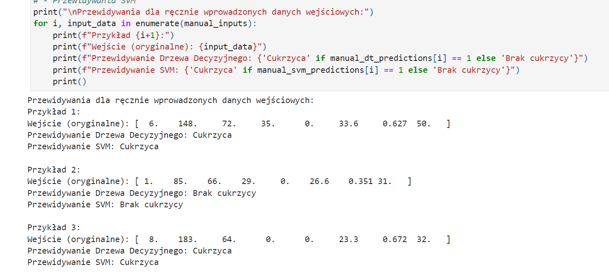

# Projekty: Wine i Diabetes

## Opis
Repozytorium zawiera dwa projekty z wykorzystaniem modeli Drzewa Decyzyjnego i SVM do klasyfikacji danych.

Autor: Karol Szmajda

1. **Wine** - Klasyfikacja jakości białego wina na podstawie cech chemicznych i sensorycznych.
2. **Diabetes** - Przewidywanie obecności cukrzycy na podstawie danych medycznych.

## Pliki
- `wine.ipynb` - Klasyfikacja jakości wina.
- `diabetes.ipynb` - Przewidywanie cukrzycy.

## Dane
- **Wine**: Plik `winequality-white.csv` (cechy takie jak kwasowość, pH, alkohol).
- **Diabetes**: Plik `diabetes.csv` (cechy takie jak glukoza, ciśnienie krwi, BMI).

## Wymagania
- Python 3.7+
- Biblioteki:
  - `pandas`
  - `numpy`
  - `matplotlib`
  - `seaborn`
  - `scikit-learn`

## Instrukcja
1. Sklonuj repozytorium.
2. Zainstaluj wymagane biblioteki:
```bash
   pip install -r requirements.txt
```


