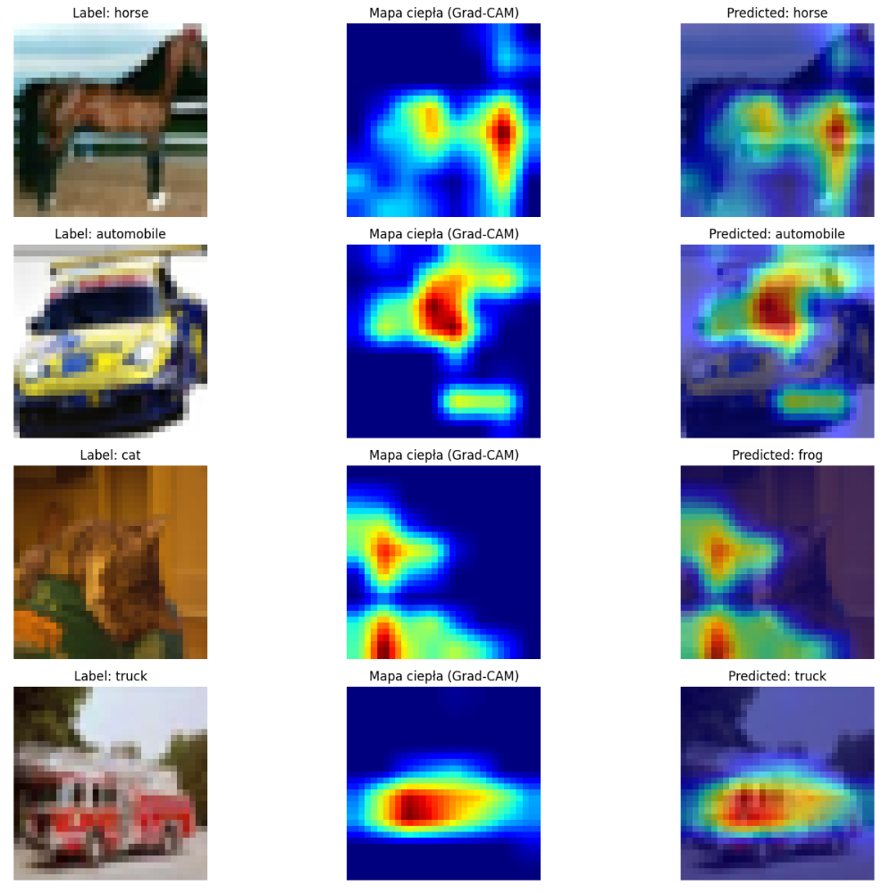

# Klasyfikacja Wine, CIFAR, Fashion MNIST, Brain Tumor

Autor: Karol Szmajda

Projekt wykorzystuje konwolucyjną sieć neuronową (CNN) do klasyfikacji obrazów. Zawiera trening, ewaluację oraz analizę wyników za pomocą metryk, takich jak macierz błędów, recall, precision oraz F1-score.

## Funkcje przykładowego projektu
- **Zestaw danych**: Cifar10
  - 10 klas obrazów RGB.
  - Rozmiar obrazów: 32x32 pikseli.
- **Model**: Konwolucyjna Sieć Neuronowa (CNN)
  - Dwa bloki konwolucyjne z Batch Normalization, aktywacją ReLU, MaxPooling i Dropout.
  - Warstwy w pełni połączone z Batch Normalization i Dropout.
- **Metryki**: 
  - Dokładność (Accuracy), Precision, Recall, F1-score dla każdej klasy.
  - Wizualizacja macierzy błędów.
- **Wykorzystane biblioteki**: TensorFlow, Keras, scikit-learn, Matplotlib, Seaborn.

## Wymagania
Aby uruchomić projekt, upewnij się, że masz zainstalowany Python 3.8 lub nowszy. Zainstaluj wymagane biblioteki za pomocą poniższego polecenia:

```bash
pip install tensorflow scikit-learn matplotlib seaborn
```



### Raport przykładowej klasyfikacji
              precision    recall  f1-score   support

    airplane       0.86      0.83      0.85      1000
  automobile       0.94      0.92      0.93      1000
        bird       0.79      0.75      0.77      1000
         cat       0.75      0.65      0.70      1000
        deer       0.77      0.85      0.81      1000
         dog       0.72      0.84      0.77      1000
        frog       0.90      0.83      0.87      1000
       horse       0.84      0.91      0.87      1000
        ship       0.87      0.92      0.89      1000
       truck       0.95      0.85      0.90      1000

    accuracy                           0.84     10000
   macro avg       0.84      0.84      0.84     10000
weighted avg       0.84      0.84      0.84     10000
